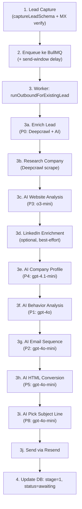

# Tantangan 0 — Teardown: Perjalanan Satu Lead Uji Melalui Pipeline KUNCI

## Ringkasan Eksekutif

KUNCI adalah AI SDR (Sales Development Representative) yang mengotomasi alur outbound sales: dari capture lead, riset perusahaan via web scraping + AI analysis, behavior analysis, generasi email sequence, hingga pengiriman email. Dokumen ini mendokumentasikan perjalanan **satu lead uji** melalui keseluruhan pipeline, termasuk setiap step, prompt AI yang aktif, dan aliran data antar-step.

---

## Arsitektur Tingkat Tinggi



---

## Perjalanan Lead Uji: Step-by-Step

### Skenario Uji
Seorang user memasukkan lead baru via form di `/capture`:

| Field | Nilai |
|---|---|
| Full Name | `Budi Santoso` |
| Email | `budi@cosulagi.id` |
| Company Name | `Cosulagi` |
| Company Website | `https://cosulagi.id` |
| Pain Points | `Butuh otomasi proses bisnis` |
| Lead Source | `website` |

---

### Step 1: Lead Capture (Sinkron — HTTP Response)

**File**: [lead.ts (router)](file:///wsl.localhost/Ubuntu/var/www/html/kunci/apps/api/src/presentation/routers/lead.ts#L57-L70)
**File**: [capture-lead.ts](file:///wsl.localhost/Ubuntu/var/www/html/kunci/apps/api/src/application/lead/capture-lead.ts)

**Alur**:
1. oRPC router `lead.capture` menerima input, divalidasi oleh Zod schema `captureLeadSchema`
2. Use case `captureLead` dipanggil:
   - **Cek duplikat**: `leadRepo.findByEmail("budi@cosulagi.id")` — jika ada, throw `conflict`
   - **Verifikasi email**: `emailVerifier.verify("budi@cosulagi.id")` — DNS MX lookup. Jika invalid, throw `badRequest`
   - **Inferensi locale**: `inferLocaleFromEmail("budi@cosulagi.id")` — dari TLD `.id` → `country: "ID"`, `language: "id"`, `timezone: "Asia/Jakarta"`, `locale: "id-ID"`
   - **Simpan ke DB**: `leadRepo.create({...})` — Lead masuk ke tabel `leads` dengan `stage: 0`, `replyStatus: "pending"`
3. Return ke router: `{ leadId: "uuid-...", status: "pipeline_enqueued", delayMs: ... }`

**Data yang mengalir keluar**: `Lead` entity (id, email, fullName, companyName, companyWebsite, country, locale, language, timezone)

**Prompt AI**: Tidak ada

---

### Step 2: Enqueue Pipeline ke BullMQ (Sinkron — masih di HTTP handler)

**File**: [lead.ts (router)](file:///wsl.localhost/Ubuntu/var/www/html/kunci/apps/api/src/presentation/routers/lead.ts#L63-L68)
**File**: [send-window.ts](file:///wsl.localhost/Ubuntu/var/www/html/kunci/apps/api/src/application/lead/send-window.ts)

**Alur**:
1. `loadSendWindowOptions(settings)` — Baca pengaturan jadwal kirim (jam kerja, timezone)
2. `computeSendDelayMs(lead.timezone, sendWindow)` — Hitung delay agar email tiba di jam kerja lokal lead
3. `pipeline.enqueue(lead.id, { delayMs })` — Job masuk ke BullMQ Redis queue

**Data**: `leadId` + `delayMs`

> [!NOTE]
> Pada titik ini, HTTP response sudah dikembalikan ke user. Pipeline berjalan di background via BullMQ worker.

---

### Step 3: Background Pipeline — `runOutboundForExistingLead`

**File**: [main.ts](file:///wsl.localhost/Ubuntu/var/www/html/kunci/apps/api/src/main.ts#L15-L18)
**File**: [run-outbound-pipeline.ts](file:///wsl.localhost/Ubuntu/var/www/html/kunci/apps/api/src/application/pipeline/run-outbound-pipeline.ts#L240-L401)

BullMQ worker mengambil job, memanggil `useCases.pipeline.runOutboundForExistingLead(lead)`.

---

#### Step 3a: Enrich Lead (P0 — Best-effort, tidak gagalkan pipeline)

**File**: [enrich-lead.ts](file:///wsl.localhost/Ubuntu/var/www/html/kunci/apps/api/src/application/lead/enrich-lead.ts)

**Alur**:
1. `scraper.getMarkdown("https://cosulagi.id")` — Deepcrawl mengambil homepage sebagai markdown
2. Jika markdown > 50 karakter → panggil AI:

**🤖 Prompt AI Aktif: P0 — Lead Enrichment**

| Aspek | Detail |
|---|---|
| File Prompt | [prompts/index.ts](file:///wsl.localhost/Ubuntu/var/www/html/kunci/apps/api/src/infrastructure/ai/prompts/index.ts#L2-L14) |
| Nama | `LEAD_ENRICHMENT_PROMPT` |
| Model | `openai/gpt-4o-mini` (default) |
| Temperature | 0.2 |
| Structured Output | JSON schema `lead_enrichment` |
| Input | Homepage markdown (max 15.000 chars) + email domain `cosulagi.id` + known company name |

**Output yang diharapkan**:
```json
{
  "companyName": "Cosulagi",
  "industry": "Consulting / Digital Transformation",
  "companySize": "11-50",
  "country": "ID",
  "language": "id",
  "targetMarket": "Indonesian SMEs looking for digital transformation",
  "recentSignals": "Expanding consulting services to ASEAN market",
  "painPointHypothesis": "Struggling with manual business processes"
}
```

3. Merge hasil AI + TLD inference → update lead di DB: `country`, `language`, `locale`, `timezone`, `companyIndustry`, `companySize`, `enrichedAt`

**Data keluar**: `EnrichLeadResult` — `updatedLead` (lead yang diperkaya) + `signals` (recentSignals, painPointHypothesis, targetMarket)

> [!IMPORTANT]
> Step ini **best-effort** — jika gagal, pipeline tetap lanjut. Error di-log sebagai warning.

---

#### Step 3b: Research Company (Scrape Website)

**File**: [research-company.ts](file:///wsl.localhost/Ubuntu/var/www/html/kunci/apps/api/src/application/research/research-company.ts)

**Alur**:
1. `leadRepo.update(lead.id, { replyStatus: "researching" })` — Mark as researching
2. `scraper.readUrl("https://cosulagi.id")` — Deepcrawl scrape ulang (lebih detail)

**Data keluar**: `scraped.markdown` + `scraped.metadata` (title, description)

> [!WARNING]
> Jika scraping gagal (`!scraped.success || !scraped.markdown`), **seluruh pipeline gagal**. Lead ditandai `research_failed`.

---

#### Step 3c: AI Website Analysis (P3)

**File**: [analyzers.ts — analyzeWebsite](file:///wsl.localhost/Ubuntu/var/www/html/kunci/apps/api/src/infrastructure/ai/analyzers.ts#L147-L203)

**🤖 Prompt AI Aktif: P3 — Website Analyzer**

| Aspek | Detail |
|---|---|
| File Prompt | [prompts/index.ts](file:///wsl.localhost/Ubuntu/var/www/html/kunci/apps/api/src/infrastructure/ai/prompts/index.ts#L54-L64) |
| Nama | `WEBSITE_ANALYZER_PROMPT` |
| Model | `openai/o3-mini` (default) |
| Structured Output | JSON schema `website_analysis` |
| Input | Website markdown (max 15.000 chars) |

**Output yang diharapkan** → `WebsiteAnalysis`:
```json
{
  "brandName": "Cosulagi",
  "tagline": "Digital Transformation Partner",
  "industryCategory": "IT Consulting",
  "keyOfferings": "Business process automation, digital strategy consulting",
  "valueProposition": "End-to-end digital transformation for Indonesian SMEs",
  "targetAudience": "SME business owners and C-level executives in Indonesia",
  "callsToAction": "Schedule a consultation, Download our playbook"
}
```

---

#### Step 3d: LinkedIn Enrichment (Opsional, Best-effort)

**File**: [research-company.ts — enrichLinkedInContext](file:///wsl.localhost/Ubuntu/var/www/html/kunci/apps/api/src/application/research/research-company.ts#L77-L87)

Jika `lead.linkedinUrl` tersedia, scrape profile LinkedIn. Jika gagal atau tidak ada → return `null`. **Tidak menggagalkan pipeline.**

---

#### Step 3e: AI Company Profile (P4)

**File**: [analyzers.ts — buildCompanyProfile](file:///wsl.localhost/Ubuntu/var/www/html/kunci/apps/api/src/infrastructure/ai/analyzers.ts#L205-L244)

**🤖 Prompt AI Aktif: P4 — Company Profiler**

| Aspek | Detail |
|---|---|
| File Prompt | [prompts/index.ts](file:///wsl.localhost/Ubuntu/var/www/html/kunci/apps/api/src/infrastructure/ai/prompts/index.ts#L67-L71) |
| Nama | `COMPANY_PROFILER_PROMPT` |
| Model | `openai/gpt-4.1-mini` (default) |
| Temperature | 0.5 |
| Input | Website title, description, `WebsiteAnalysis`, LinkedIn context, website markdown (max 10.000 chars) |
| Output | `string` — Profil perusahaan terstruktur dalam prose |

**Data keluar**: `companyProfile` (string panjang) → disimpan ke `lead.companyResearch` di DB

Setelah selesai: `leadRepo.update(lead.id, { companyResearch: companyProfile, replyStatus: "ready" })`

---

#### Step 3f: AI Behavior Analysis (P1)

**File**: [analyzers.ts — analyzeBehavior](file:///wsl.localhost/Ubuntu/var/www/html/kunci/apps/api/src/infrastructure/ai/analyzers.ts#L82-L145)

**🤖 Prompt AI Aktif: P1 — Behavior Analyzer**

| Aspek | Detail |
|---|---|
| File Prompt | [prompts/index.ts](file:///wsl.localhost/Ubuntu/var/www/html/kunci/apps/api/src/infrastructure/ai/prompts/index.ts#L17-L27) |
| Nama | `BEHAVIOR_ANALYZER_PROMPT` |
| Model | `openai/gpt-4o` (default) |
| Structured Output | JSON schema `behavior_analysis` |
| Input | Lead name, email, company, website, LinkedIn URL, pain points + Company Profile (dari P4) |

**Output yang diharapkan** → `BehaviorAnalysis`:
```json
{
  "painPoints": "Manual operations, lack of automation...",
  "behavioralProfile": "Analytical decision-maker, values efficiency...",
  "journeyStage": "Consideration",
  "psychologicalTriggers": "Efficiency gains, competitive advantage...",
  "optimalApproach": "Data-driven pitch with ROI examples...",
  "conversionProbability": 0.65
}
```

> [!WARNING]
> Jika gagal → **pipeline berhenti** dan lead ditandai `research_failed`.

---

#### Step 3g: AI Email Sequence Generation (P2)

**File**: [generators.ts — generateEmailSequence](file:///wsl.localhost/Ubuntu/var/www/html/kunci/apps/api/src/infrastructure/ai/generators.ts#L25-L104)
**File**: [send-email.ts — makeSendInitialEmailUseCase](file:///wsl.localhost/Ubuntu/var/www/html/kunci/apps/api/src/application/email/send-email.ts#L114-L206)

**🤖 Prompt AI Aktif: P2 — Email Sequence Generator**

| Aspek | Detail |
|---|---|
| File Prompt | [prompts/index.ts](file:///wsl.localhost/Ubuntu/var/www/html/kunci/apps/api/src/infrastructure/ai/prompts/index.ts#L30-L51) |
| Nama | `SEQUENCE_GENERATOR_PROMPT` |
| Model | `openai/gpt-4o-mini` (default) |
| Structured Output | JSON schema `email_sequence` |
| Input | Lead info + locale context + business context (dari settings) + behavioral profile (dari P1) |

**Output**: `GeneratedSequence` — 3 email dengan masing-masing: purpose, 3 subject lines, content, CTA, timing, psychological trigger.

Email disimpan ke tabel `email_sequences`.

---

#### Step 3h: AI HTML Conversion (P5)

**File**: [generators.ts — convertToHtml](file:///wsl.localhost/Ubuntu/var/www/html/kunci/apps/api/src/infrastructure/ai/generators.ts#L106-L169)

**🤖 Prompt AI Aktif: P5 — HTML Converter**

| Aspek | Detail |
|---|---|
| File Prompt | [prompts/index.ts](file:///wsl.localhost/Ubuntu/var/www/html/kunci/apps/api/src/infrastructure/ai/prompts/index.ts#L74-L90) |
| Nama | `EMAIL_HTML_CONVERTER_PROMPT` |
| Model | `openai/gpt-4o-mini` (default) |
| Temperature | 0.3 |
| Input | Email content (teks dari email pertama) |
| Dynamic injection | Color scheme dari settings (primary, accent, CTA, text, background, font family) |
| Output | Raw HTML string (langsung, bukan JSON) |

Setelah konversi:
1. Append footer (unsubscribe link + branding)
2. Apply company profile (jika mode = URL → inject CTA; jika mode = file → attach PDF)
3. Simpan HTML ke `email_sequences.htmlContent`

---

#### Step 3i: AI Pick Subject Line (P8)

**File**: [generators.ts — pickSubjectLine](file:///wsl.localhost/Ubuntu/var/www/html/kunci/apps/api/src/infrastructure/ai/generators.ts#L234-L283)

**🤖 Prompt AI Aktif: P8 — Subject Line Picker**

| Aspek | Detail |
|---|---|
| File Prompt | [prompts/index.ts](file:///wsl.localhost/Ubuntu/var/www/html/kunci/apps/api/src/infrastructure/ai/prompts/index.ts#L108-L112) |
| Nama | `SUBJECT_LINE_PICKER_PROMPT` |
| Model | `openai/gpt-4o-mini` (default) |
| Structured Output | JSON schema `subject_pick` |
| Input | Lead info + locale context + 3 subject line variations |
| Output | `{ subject_line: "..." }` |

---

#### Step 3j: Send Email via Resend

**File**: [send-email.ts](file:///wsl.localhost/Ubuntu/var/www/html/kunci/apps/api/src/application/email/send-email.ts#L170-L199)

**Alur**:
1. `emailService.send({ to, subject, html, leadId, stage: 1, unsubscribeUrl, attachments })` → Resend API
2. `sequenceRepo.markSent(firstEmail.id)` — Tandai email 1 sebagai terkirim
3. `leadRepo.update(lead.id, { stage: 1, replyStatus: "awaiting", latestMessageId, messageIds, lastEmailSentAt })`

**Data final di DB**:

| Field | Nilai |
|---|---|
| `stage` | `1` |
| `replyStatus` | `"awaiting"` |
| `latestMessageId` | Resend message ID |
| `lastEmailSentAt` | Timestamp pengiriman |

---

## Ringkasan Prompt AI yang Aktif

| # | Prompt | Model | Tipe | Gagal = Pipeline Berhenti? |
|---|---|---|---|---|
| P0 | Lead Enrichment | gpt-4o-mini | Structured JSON | ❌ (best-effort) |
| P3 | Website Analyzer | o3-mini | Structured JSON | ✅ (indirectly via research) |
| P4 | Company Profiler | gpt-4.1-mini | Free-text string | ✅ (indirectly via research) |
| P1 | Behavior Analyzer | gpt-4o | Structured JSON | ✅ |
| P2 | Email Sequence Generator | gpt-4o-mini | Structured JSON | ✅ |
| P5 | HTML Converter | gpt-4o-mini | Raw HTML string | ✅ |
| P8 | Subject Line Picker | gpt-4o-mini | Structured JSON | ✅ |

**Total: 7 panggilan AI per lead** (minimal), semua melewati queue concurrency limiter (`OPENROUTER_MAX_CONCURRENCY`, default 3).

---

## Aliran Data Antar-Step

```mermaid
flowchart LR
    subgraph Input
        A1["User Input<br/>name, email, company, website"]
    end

    subgraph Capture
        B1["Lead Entity<br/>(DB row, stage=0, pending)"]
    end

    subgraph Enrich
        C1["Homepage Markdown<br/>(Deepcrawl)"]
        C2["EnrichedLeadData<br/>(P0 AI: country, industry, size)"]
        C3["Updated Lead<br/>(country, language, locale, timezone...)"]
    end

    subgraph Research
        D1["Full Website Markdown<br/>(Deepcrawl readUrl)"]
        D2["WebsiteAnalysis<br/>(P3 AI: brand, industry, offerings)"]
        D3["LinkedInProfileContext<br/>(optional)"]
        D4["Company Profile string<br/>(P4 AI)"]
    end

    subgraph Analyze
        E1["BehaviorAnalysis<br/>(P1 AI: pain points, triggers, probability)"]
    end

    subgraph Generate_Send
        F1["GeneratedSequence<br/>(P2 AI: 3 emails)"]
        F2["HTML Email<br/>(P5 AI)"]
        F3["Selected Subject<br/>(P8 AI)"]
        F4["Resend Result<br/>(messageId, sentAt)"]
    end

    A1 --> B1
    B1 --> C1
    C1 --> C2
    C2 --> C3
    C3 --> D1
    D1 --> D2
    D2 --> D4
    D3 -.-> D4
    C3 --> E1
    D4 --> E1
    E1 --> F1
    F1 --> F2
    F1 --> F3
    F2 --> F4
    F3 --> F4
```



---

## Bagian yang Rapuh atau Dapat Diperbaiki

### 🔴 1. Scraping Ganda yang Redundan (Fragile + Wasteful)

**Lokasi**: [enrich-lead.ts:37](file:///wsl.localhost/Ubuntu/var/www/html/kunci/apps/api/src/application/lead/enrich-lead.ts#L37) dan [research-company.ts:35](file:///wsl.localhost/Ubuntu/var/www/html/kunci/apps/api/src/application/research/research-company.ts#L35)

**Masalah**: Website di-scrape **dua kali** berturut-turut — sekali di `enrichLead` (`scraper.getMarkdown`) dan sekali lagi di `researchCompany` (`scraper.readUrl`). Ini membuang waktu, bandwidth, dan meningkatkan risiko rate-limit dari target website.

**Perbaikan**: Cache hasil scrape pertama dan gunakan kembali, atau gabungkan kedua step menjadi satu operasi scrape + enrich + research.

---

### 🔴 2. Pipeline Monolitik Tanpa Checkpoint (Fragile)

**Lokasi**: [run-outbound-pipeline.ts:240-401](file:///wsl.localhost/Ubuntu/var/www/html/kunci/apps/api/src/application/pipeline/run-outbound-pipeline.ts#L240-L401)

**Masalah**: Jika pipeline gagal di step 5 (behavior analysis), **semua progress dari step 1-4 hilang** — pipeline harus diulang dari awal via retry. Data seperti `companyResearch` sudah tersimpan di DB, tetapi retry tetap menjalankan scrape + website analysis + company profiler ulang.

**Perbaikan**: Implementasi checkpointing — retry pipeline seharusnya melanjutkan dari step yang gagal, bukan dari awal. Middleware `retryPipeline` sudah ada tapi tidak memanfaatkan data research yang sudah tersimpan di `lead.companyResearch`.

---

### 🟡 3. `pipeline.email_sequence_count` Setting Tidak Berpengaruh (Bug)

**Lokasi**: [setting-keys.ts:63](file:///wsl.localhost/Ubuntu/var/www/html/kunci/apps/api/src/domain/settings/setting-keys.ts#L63)

**Masalah**: Setting `PIPELINE_EMAIL_SEQUENCE_COUNT` ada di `SETTING_KEYS` tapi **tidak pernah dibaca oleh `generateEmailSequence`**. Prompt P2 selalu hardcode "3-email nurturing sequence". Mengubah setting ini di UI tidak menghasilkan perubahan jumlah email.

**Perbaikan**: Baca setting ini di `generateEmailSequence` dan injeksikan ke prompt P2 secara dinamis, misalnya `Generate a ${count}-email nurturing sequence`.

---

### 🟡 4. Step Tracking Misleading (Desync)

**Lokasi**: [run-outbound-pipeline.ts:138-167](file:///wsl.localhost/Ubuntu/var/www/html/kunci/apps/api/src/application/pipeline/run-outbound-pipeline.ts#L138-L167)

**Masalah**: Step 4 (`analyze_website`) dan Step 5 (`build_profile`) di pipeline tracker dicatat **setelah** `researchCompany()` selesai — padahal langkah AI sebenarnya sudah terjadi di dalam `researchCompany()`. Tracker hanya mencatat timestamp akhir, bukan durasi sebenarnya dari masing-masing panggilan AI. Ini memberi kesan bahwa step 4 dan 5 instan, padahal bisa masing-masing memakan waktu 5-15 detik.

---

### 🟡 5. Hardcoded `companyWebsite` sebagai Mandatory (Inbound Blocker)

**Lokasi**: [lead.ts (router):40](file:///wsl.localhost/Ubuntu/var/www/html/kunci/apps/api/src/presentation/routers/lead.ts#L40) dan [lead.ts (domain):66](file:///wsl.localhost/Ubuntu/var/www/html/kunci/apps/api/src/domain/lead/lead.ts#L66)

**Masalah**: `companyWebsite` di-enforce sebagai `.url().required()` di Zod schema dan `notNull()` di DB schema. Segmen **Talent** (individu pencari kerja) tidak memiliki perusahaan atau website. Lead tanpa website **tidak bisa masuk pipeline sama sekali**.

**Dampak langsung pada bisnis**: PERFECT10 ingin mengelola 3 segmen (Talent, Agency, Enterprise), tapi arsitektur saat ini secara fundamental menghalangi segmen Talent.

---

### 🟡 6. Tidak Ada Konsep Segmen (Arsitektur Gap)

**Lokasi**: [lead.ts (domain)](file:///wsl.localhost/Ubuntu/var/www/html/kunci/apps/api/src/domain/lead/lead.ts)

**Masalah**: Entity `Lead` tidak memiliki field `segment` (talent / agency / enterprise). Semua lead diperlakukan sama — mendapat prompt, nada, dan CTA yang identik. Ini bertentangan langsung dengan kebutuhan bisnis PERFECT10 yang membutuhkan pesan tersegmentasi.

---

### 🟢 7. Concurrency Queue Sederhana tapi Efektif

**Lokasi**: [queue.ts](file:///wsl.localhost/Ubuntu/var/www/html/kunci/apps/api/src/infrastructure/ai/queue.ts)

**Catatan positif**: Queue concurrency limiter untuk OpenRouter requests dibuat sederhana (in-memory semaphore) — ini bekerja baik untuk single-instance deployment, tapi **tidak aman untuk multi-instance** karena state `active` tidak dishare antar proses.

---

## Ringkasan Flow Lainnya (Non-Outbound)

### Flow 2: Reply Handling
**Trigger**: Webhook Resend → `handleReply()` → Intent Classification (P9) → Generate Chat Reply (P10) → HTML Convert (P5) → Send reply via Resend thread

### Flow 3: Scheduled Follow-ups
**Trigger**: Cron harian → `processPendingFollowups()` → Cari lead `status=awaiting, stage≤2, lastEmail>4hari` → `sendFollowup()` → Pick next email template → HTML + Subject Line → Send in-thread

---

## Catatan Tambahan

- **Semua prompt bisa di-override via Settings UI** — `PromptLoader` membaca dari `app_settings` tabel (fallback ke static prompt di code)
- **Semua model bisa diganti via Settings** — setiap prompt punya setting `ai.model.*` tersendiri  
- **Error handling** secara umum baik — setiap step di-wrap try/catch dengan tracker logging, dan status lead di-update ke `research_failed` saat pipeline gagal
- **Locale awareness** sudah diimplementasikan — email tone menyesuaikan country/language lead (via `formatLocaleContext`)
- **Business context** di-inject ke prompt P2, P6/P7, P10 — diambil dari settings (company name, offerings, tone of voice, dll.)
